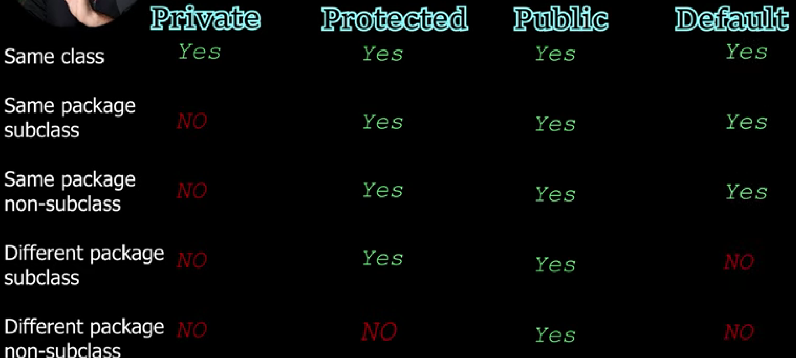

AND --> &&
OR --> ||
NOT--> !
/*
 * All Relational operatoroperation ==,!=,<=,>=,<,>
 */

## Bitwise operator
"&" - Bitwise and
"|" - Bitwise or
"^" - Bitwise XOR
"<<" - left shift
">>" - Right shift

Order to cover Topics :
1. Hello_world
2. Datatypes
3. Basic_math
4. Scanner_method
5. Comparing_in_Java

